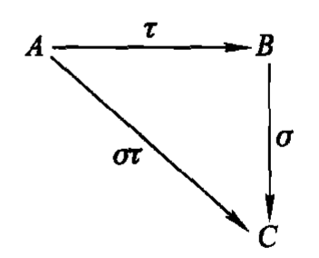
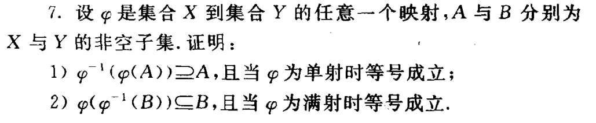
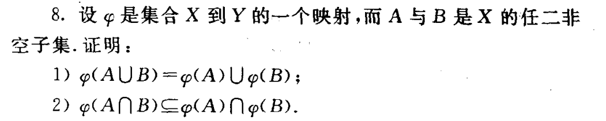
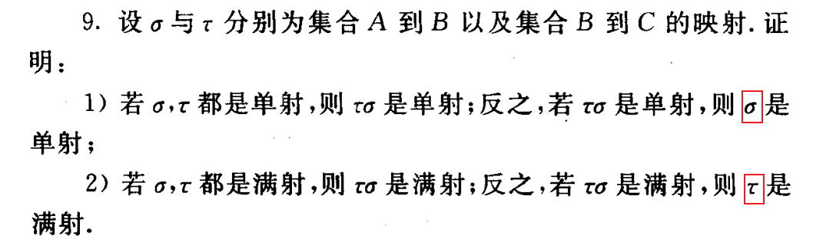
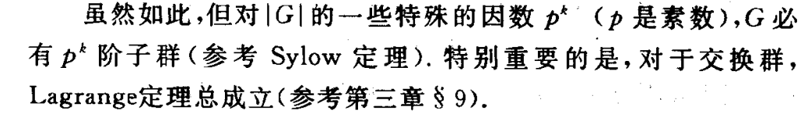
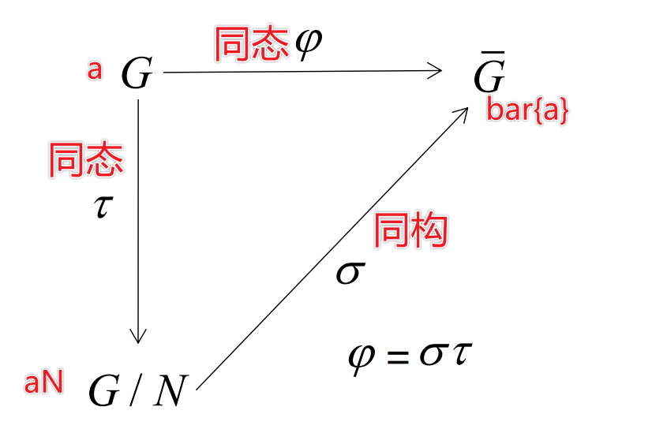
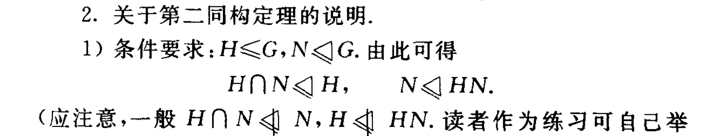
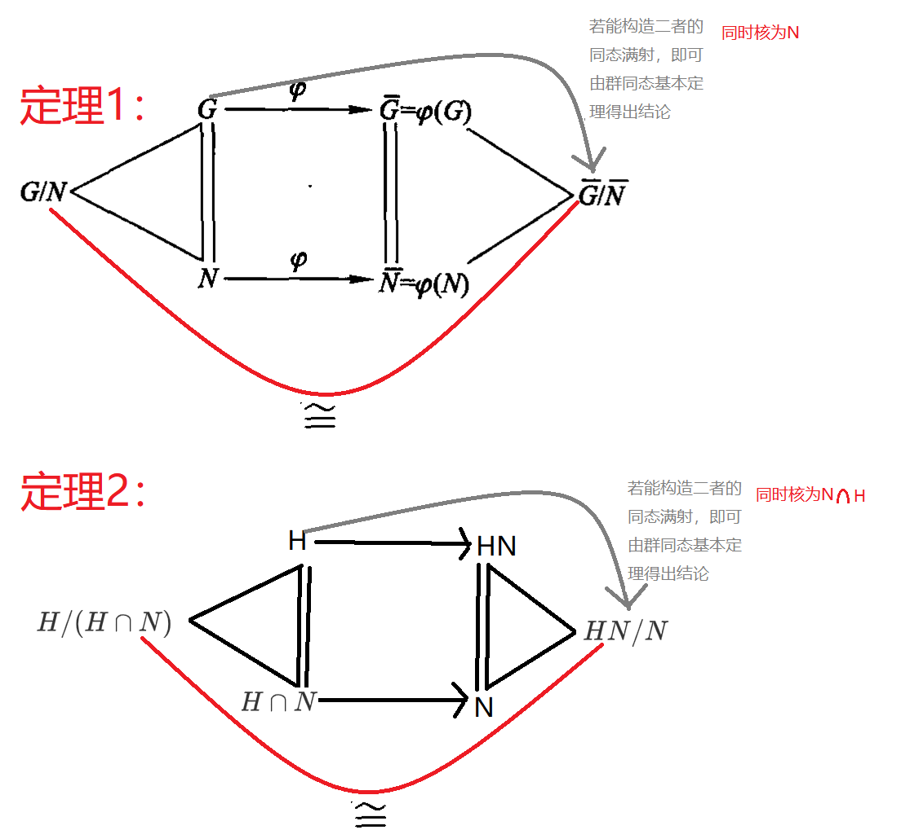
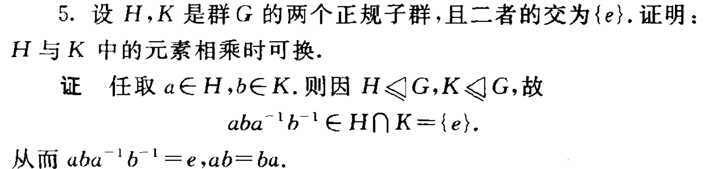

# 近世代数

> 但愿码了这么多字能有点用^^^__^^^
>
> 该忘还是得忘……

## 第一章

#### 1.集合

> Z^*^表示非零整数集
>
> ==要证两个集合A与B相等，常需证明$A\subseteq B且 B\supseteq A$==
>
> 集合A的幂集P(A),其阶|P(A)| = 2^n^

#### 2.映射与变换

**定义 1：** 设 $A$ 与 $B$ 是两个集合. 如果有一个法则 $\varphi$, 它对于 $A$ 中**每个元素 $x$**, 在 $B$ 中都有一个**唯一确定**的元素 $y$ 与它对应,则称 法则 $\varphi$ 为集合 $A$ 到集合 $B$ 的一个映射. 这种关系常表示成 $\varphi:  x \longrightarrow y$ 或 $y=\varphi(x)$,

并且把 $y$ 叫做 $x$ 在映射 $\varphi$ 之下的像,而把 $x$ 叫做 $y$ 在映射 $\varphi$ 之下 的**原像**或**逆像**.

> 集合B包含值域，但不一定是值域，在映射$\varphi$之下不一定B中每个元素都有逆像。
>
> A中不同元素在B中的像却可能相同
>
> 只有双射才有逆映射

- 能建立双射的充要条件是|A| = |B|

==定理 1：==设A与B是两个有限集合且|A| = |B|，$\varphi$是A到B的一个映射。则

​							$\varphi$是满射    $\Longleftrightarrow \varphi$是单射

推论：设A与B是两个所含**元素个数相等**的有限集合，则A到B的映射$\varphi$是双射当且仅当$\varphi$是满(单)射

- ==映射乘法==(合成)
  - **不满足交换律**
  - 

**定义：**集合A到自身的映射，叫做集合A的一个变换

==定理 2：==含n个元素的任意集合共有==n!==个双射变换（一个双射变换称为n元置换）

#### 3.代数运算

- **定义：**设M是一个集合。如果有一个法则，它对M中任意两个元素a与b，在M中有一个==唯一确定==的元素d与它们对应，则称这个法则是集合M的一个代数运算
- 变换运算：
  - 用T(M)表示M的全体变换作成的集合（易知|T(M)|= n^n^）
  - 变换乘法是T(M)的一个代数运算
  - 变换乘法是S(M)的一个代数运算
- 乘法表：利用乘法表不难得出n元集合的代数运算个数为==$n^{n^{2}}$.==
- ==总结==
  - 全体变换（T(M)）个数：n^n^
  - 双射变换（S(M)）个数：n!
  - 代数运算个数：$n^{n^{2}}$

#### 4.运算律

- 代数运算满足结合律：(a $\circ$ b) $\circ$ c = a $\circ$ (b $\circ$ c)		[变换的乘法满足结合律]

- ==定理 1：==若集合M有代数运算 $\circ$ 满足结合律，则对M中任意n(n$\geqslant$3)个元素无论怎样加括号，其结果都相等

- 代数运算满足交换律：a $\circ$ b = b $\circ$ a

- ==定理 2：==若集合M有代数运算 $\circ$ 既满足结合律又满足交换律。则对M中任意n个元素进行运算时可以任意结合和交换元素的前后次序，其结果均相等.

- **定义 ：**设集合 $M$ 有两个代数运算$\circ$ 及$\oplus$. 如果对 $M$ 中任意 元素 $a, b, c$, 都有
  $$
  a \circ(b \oplus c)=\left(a \circ b\right) \oplus\left(a \circ c\right)
  $$
  则称运算$\circ$对$\oplus$满足左分配律; 如果
  $$
  (b \oplus c) \circ a=\left(b \circ a\right) \oplus\left(c \circ a\right)
  $$
  则称运算$\circ$对$\oplus$满足右分配律

- ==定理 3：== 设集合 $M$ 有两个代数运算$\circ$及$\oplus$,其中$\oplus$满足结合律, 而$\circ$对$\oplus$满足左分配律, 则对 $M$ 中任意元素 $a$ 及 $b_{1}, b_{2}, \cdots, b_{n}$ 有 $a\circ\left(b_{1} \oplus b_{2} \oplus \cdots \oplus b_{n}\right)=\left(a\circ b_{1}\right) \oplus \cdots \oplus\left(a\circ b_{n}\right)$

#### 5.同态与同构

> 两个代数系统同构，则它们之间可能有多个同构映射存在
>
> - ==构造同态映射或同构映射时==，如果代数运算是加法，可构造乘法的映射；如果代数运算是乘法，可构造加法的映射。这样可以尽可能使构造出来的映射是两个代数系统之间的同态映射

==定理 1：==设集合M与$\bar{M}$分别有代数运算$\circ$与$\bar{\circ}$，且$M \sim \bar{M}$,则

​				1）当$\circ$满足结合律时，$\bar{\circ}$也满足结合律

​				2）当$\circ$满足交换律律时，$\bar{\circ}$也满足交换律

> 需要注意的是，定理反之不一定成立，因为两个代数系统之间同态，只能说明M到$\bar{M}$是满射（证明定理1实际上需要用到满射的条件），不能说明$\bar{M}$到M是满射，故反之不一定成立。而如果M与$\bar{M}$同构，自然二者都成立

==定理 2：==将定理1拓展到左（右）分配律

#### 6.等价关系与集合的分类

> 自反性：对M中任意元素a都有aRa; (注意这里说的是==任意元素==)

定理1：集合M的一个分类决定M的一个等价关系

定理2：集合M的一个等价关系决定M的一个分类

## 第二章

#### 1.群的定义

- **非空集合G有代数运算**

- 1、结合律成立

- 2、群中任意元素有左单位元

- 3、群中任意元素有左逆元

  > G的代数运算满足交换律-->交换群(Abel群)

##### 群的初步性质

- ==定理1：==群G的左单位元也是右单位元，并且是唯一的

  （证明：1、设e为左单位元，构建a^-1^a=e,a^'^a^-1^=e,然后推出ae=a；）

- ==定理2：==群G中的元素a的左逆元a^-1也是a的右逆元，并且是唯一的

  （证明：设a^-1^a=e,a^'^a=e，推出aa^-1^=e=a^-1^a）

- ==推论1：==在群中消去律成立，即：

  ​			ab=ac   $\Longrightarrow$  b=c

  ​			ba=ca   $\Longrightarrow$  b=c

- 半群：代数运算满足结合律的非空集合

- 幺半群：有单位元的半群

- ==定理3：==设G是一个半群，则G作成一个群的充要条件是，对G中==任意元素==a，b,方程ax=b, ya=b, 在G中都有解

  > 其实这里相当于群的另一种定义方法，方程定义法
  >
  > 证明：由两等式成立知：eb=b,bc=a;ea=ebc=bc=a(左单位元),ya=e(左逆元)

- 推论2：==有限半群==G作成群的充要条件是，在G中两个消去律成立

> 若群G中每个元素都满足方程x^2^=e，则G必为交换群

#### 2.群中元素的阶

- 定义1：设a为群G的一个元素，使a^n^=e 成立的最小正整数n，叫做元素a的阶。常用|a|表示

- ==定理1：==有限群中每个元素的阶有限（注：无限群中元素的阶可能无限，也可能有限，甚至可能每个元素的阶都有限）

- 定义2：周期群（每个元素的阶都有限）；无扭群（除e外其余元素的阶均无限）；既不是周期群又不是无扭群的群称为混合群

- ==定理2：==设群G中元素a的阶是n，则$a^{m}=e \ \Longleftrightarrow n|m$ 

- ==定理3：==若元素a的阶是n，则$|a^{k}|= \frac{n}{(k,n)}$

- 推论1：在群中若|a| = st, 则|a^s^| = t. 其中s,t是正整数

- 推论2：在群中若|a^k^| = n,$\Longleftrightarrow (k,n)=1$ 

  > 设G是群，且|G|>1。则若G中除单位元e外其余元素的阶都相同，则这个相同的阶不是无限就是一个素数

- ==定理4：==若群中元素a的阶是m，元素b的阶是n，则当==ab=ba==且(m,n) = 1时，有|ab| = mn，即|ab| = |a|·|b|

- ==定理5：==设G为交换群，且G中所有元素有最大阶m，则G中每个元素的阶都是m的因数，从而群G中每个元素均满足方程x^m^=e.

> 1. 在一个有限群里，阶大于2的元素的个数一定是偶数。（a与a^-1^的阶相等，故阶大于2（阶大于2说明a不等于a^-1^）的元素是成对出现的）
> 2. 偶数阶群中阶等于2的元素个数一定是奇数。（1阶元素为e，2阶以上元素为偶数个，所以2阶元素为奇数个）

#### 3.子群

- 定义1：设G是一个群，H是G的一个非空子集。如果H本身对G的乘法也作成一个群，则称H为群G的一个子群（H<=G）。（{e}和G为群G的平凡子群，别的子群为群G的非平凡子群或真子群(H<G)）

- ==定理1：==设G是群，H<=G.则子群H的单位元就是群G的单位元，H中元素a在H中的逆元就是a在G中的逆元

- ==定理2：==群G的一个非空子集H作成子群的充要条件是：

  ​		1）$a,b \in H \Longrightarrow ab \in H$;

  ​		2）$a \in H \Longrightarrow a^{-1}\in H$.

  > 证明：必要性显然；下证充分性
  >
  > ​	由（1）知G的代数运算也是H的代数运算，故H也满足结合律
  >
  > ​	由（2）知，当a$\in$H时，a^-1^$\in$H，e = aa^-1^=H，故H是群，进而H是G的子群

- ==定理3：==群G的非空子集H作成子群的充要条件是：$a,b \in H \Longrightarrow ab^{-1} \in H$

  > 证明：充分性显然，下证必要性
  >
  > ​	由$a,a \in H$知，$aa^{-1} \in H$，即$e \in H$;
  >
  > ​	从而由$e,a \in H$知，$ea^{-1} \in H$，即$a^{-1} \in H$;
  >
  > ​	同理当$b \in H$时 有b^-1^$\in $H;
  >
  > ​	从而当$a,b \in H$时，由$a,b^{-1} \in H$知，$a{(b^{-1})}^{-1} \in H$，即$ab \in H$;
  >
  > ​	由定理2知，H是群G的子群

- ==群G的==有限子集H作成子群的充要条件是，H对G的乘法封闭，即：$a,b \in H \Longrightarrow ab \in H$.

- 定义2：令G是一个群，G中的元素a如果同G中每个元素都可换，则称a是群G的一个中心元。（若一个群只有e这一个中心元，则称该群为无中心群）

  > 中心群的条件比正规子群更强

- ==定理4：==群G的全体中心元作成的集合C(G)是G的一个子群，称为群G的中心
      群G的中心显然是G的交换子群，又显然G是交换群当且仅当C(G)=G

- 定义3：设A、B是群G的任二非空子集，规定$AB = \{ab|a \in A,b \in B\},\ A^{-1}=\{a^{-1}|a \in A \}$.

- 推论1：设H是群G的一个非空子集，则$H \leqslant G \ \Longleftrightarrow \ HH=H \ 且 \  H^{-1}=H$

- 推论2：设H是群G的一个非空子集，则$H \leqslant G \ \Longleftrightarrow \ HH^{-1}=H$

- 定理5：设H,K是群G的两个子群，则$HK \leqslant G \ \Longleftrightarrow \ HK=KH$

  > 一般子群的乘积不是子群（交换群除外），交换群的任二子群之积必仍为子群
  >
  > 证明：充分性：结合推论1可证；必要性：结合推论2可证

#### 4.循环群

- <M>:1、由M生成的子集；2、包含M的最小子群

- 定义1：称<M>为群G中由子集M生成的子群，并把M叫做这个子群的生成系

- 定义2：如果群G可以由一个元素a生成，即G=<a>，则称G为由a生成的一个循环群，并称a为G的一个生成元。

  > 循环群必是交换群，（交换群的阶均为最大阶n的因数）

- ==定理1：==设G=<a>为任一循环群，则
      （1）当|a| = ∞时，G = <a>       ={$… a^{-2},a^{-1},e,a,a^{2}…$}为无限循环群，且与整数加群Z同构；
      （2）当|a| = n时，G = <a> ={$e,a,a^{2},a^{3}…a^{n-1}$}为n阶循环群，且与n次单位根群Un同构。

- ==推论1：==n阶群中有阶为n的元素，则这个群为循环群，这个元素为生成元

- 无限循环群<a>有两个生成元，即a与a^-1^；n阶循环群有ψ(n)个生成元，其中ψ(n)为欧拉函数

  >  ψ(n)：小于n且与n互质的整数的个数
  >
  > 证明：当(k,n)=1时，|a^k^|=n,故a^k^是生成元

- ==定理3：==循环群的子群仍为循环群

> 证明：设$a^{m}$为最小正幂，证明$<a^{m}>$与H互相包含

- ==定理4：==无限循环群G=$<a>$有无限个子群；当G=<a>为n阶循环群时，对n的每个正因数k，G**有且只有一个**k阶子群，这个子群就是$<a^{ \frac{n}{k}}>$.

  > 证明：设n=kq，则a^q^=k,<a^q^>是k阶子群；在设H=<a^m^>是k阶子群；从而得证

- ==推论2：==n阶循环群有且仅有T(n)个子群

  > T(n)表示正因数的个数
  >
  > $n=p_{1}^{k_1}p_{2}^{k_2}...p_{m}^{k_m}$
  >
  > $T(n)=(k_1+1)(k_2+1)...(k_m+1)$

#### 5.变换群

**定义1：**一些变换关于变换的乘法作成的群称为变换群

==定理1：==设M为任一非空集合，S(M)为由M全体双射变换作成的集合。则S(M)关于变换的乘法作成一个群

**定义2：**称集合M的双射变换群S(M)为M上的对称群，当M的阶为n时，对称群用$S_{n}$表示，并称n元对此群

易知：S(M)为M上最大的双射变换群

==定理2：==设G是集合M的一个变换群，则：
$$
G \text { 是双射变换群 } \Longleftrightarrow G \text { 含有 } M \text { 的单(满)射变换. }
$$
> 先证明G的单位元必是M的恒等变化；再证G中的元素都是都是M的双射变换

==推论1：==设G是集合M的一个变换群，则：
$$
G \text { 是双射变换群 } \Leftrightarrow G \text { 包含恒等变换. }
$$

>注意：不是双射变换群的变换群，就必然是非双射变换群（因为非双射变换群连任何单射或满射变换都不能包含）

==定理3：==任何群都同一个（双射）变换群同构

> 先证：$\uptau_a：x \rightarrow ax\ $，$\bar{G}=\{\uptau_a|a \in G\}$为双射变换群，再证$\bar{G} \cong G$

==推论2：==任何n阶有限群都与n元对称群$S_{n}$的一个子群（置换群）同构

#### 6.置换群

**定义1：**n元对称群$S_{n}$的任意一个子群，都叫做n元置换群，简称置换群

**定义2：**k轮换。2-轮换简称对换，无公共数码的轮换称为**不相连轮换**

==定理1：==不相连轮换相乘时，可以交换

==定理2：==每个（非轮换）置换都可以表示为不相连轮换之积，每个轮换都可以表示为对换之积，因此，==每个置换都可以表示为对换之积==

（一个置换对应一个双射）

==定理3：==每个置换表示成对换的乘积时，其对换个数的奇偶性不变

> 理解：
>
> ​	假设置换针对的群是{1，2，3}，例如$\upsigma=(132)$,  则$\upsigma$将123变为312.
>
> ​	而312的逆序数为2，故将123变为312需要两次对换
>
> ​	序列经过一次对换就改变奇偶性，因为123是偶排列，故312的奇偶性与对换的次数的奇偶性相同
>
> ​	推广到更一般的情况，$\upsigma(1)\upsigma(2)\upsigma(3)...\upsigma(n)$的奇偶性与对换的个数的奇偶性相同。但不论$\upsigma$表示成多少个对换之积，$\upsigma(1)\upsigma(2)\upsigma(3)...\upsigma(n)$的奇偶性是完全确定的，故对换个数的奇偶性也是完全确定的

由此易知，$\sigma$是奇(偶)置换当且仅当$\upsigma(1)\upsigma(2)\upsigma(3)...\upsigma(n)$是奇(偶)排列，即其逆序数是奇(偶)数

**定义3：**一个置换若分解成奇数个对换的乘积，则称为奇置换；否则称为偶置换

> - 恒等置换是偶置换

故 $n !$ 个 $n$ 元置换中奇偶置换==各半==,各为$\frac{n !}{2} 个 .$

由于恒等置换是偶置换, 又任二偶置换之积仍为偶置换, 因 此, $S_{n}$ 中全体偶置换作成一个 $\frac{n !}{2}$ 阶的子群, 记为 $A_{n}$, 称为 ==$n$ 元交代 (交错)群==.（偶置换群）

**证明：**一个n元置换群G中的置换或者全是偶置换，或者奇、偶置换各占一半，且其全体偶置换作成一个子群

> 若对于G中的任一一个元素x，均有x^2=e,则G为交换群

==定理4：==k-轮换的阶为k，不相连轮换乘积的阶为各因子的阶的最小公倍数

==定理 5：== 设有 $n$ 元置换 $\tau=\left(\begin{array}{cccc}1 & 2 & \cdots & n \\ i_{1} & i_{2} & \cdots & i_{n}\end{array}\right)$, 则对任意 $n$ 元 置换 $\sigma$, 有
$$
\sigma \tau \sigma^{-1}=\left(\begin{array}{llll}
\sigma(1) & \sigma(2) & \cdots & \sigma(n) \\
\sigma\left(i_{1}\right) & \sigma\left(i_{2}\right) & \cdots & \sigma\left(i_{n}\right)
\end{array}\right)
$$

> 1. k轮换可以写成(k-1)个对换之积：$i_1i_2i_3...i_k=(i_1i_k)(i_1i_{k-1})...(i_1i_3)(i_1i_2)$
>
> 2. 恒等置换是偶置换
>
> 3. 偶置换之积为偶置换
>
> 4. 奇置换之积为偶置换
>
> 5. 一个奇置换与一个偶置换之积为奇置换
>
> 6. 1） $k$-轮换与 $k$ 有相反奇偶性.（可由1知）
>
>    2）$k$-轮换的阶为 $k .$ 又 $\left(i_{1} i_{2} \cdots i_{k}\right)^{-1}=\left(i_{k} \cdots i_{2} i_{1}\right)$.
>
> 7. 当$n\geqslant3$时，n元对称群S~n~是无中心群

#### 7.陪集、指数和Lagrange定理

**定义 1：** 设 $H$ 是群 $G$ 的一个子群, $a \in G$. 则称群 $G$ 的子集
$$
a H=\{a x \mid x \in H\}
$$
为群 $G$ 关于子群 $H$ 的一个**左陪集**. 而称
$$
H a=\{x a \mid x \in H\}
$$
为群 $G$ 关于子群 $H$ 的一个**右陪集**.

==左陪集的性质：==

- $a \in a H$

- $a \in H \quad \Longleftrightarrow a H=H$

- $b \in a H \Longleftrightarrow a H=b H$.

- $a H=b H$, 即 $a$ 与 $b$ 同在一个左陪集中 $\Longleftrightarrow a^{-1} b \in H$(或 $\left.b^{-1} a \in H\right)$.

  > 这里的结论是a（b）的逆在前，而若前提是右陪集，则逆在后

- 若 $a H \cap b H \neq \varnothing$, 则 $a H=b H$.

  这表明，对任二左陪集来说，要么相等，要么无公共元素。G的全体不同的左陪集构成群G的元素的一个分类，而且两个元素a与b同在一类当且仅当$a^{-1} b \in$H

  如果用 $a H, b H, c H, \cdots$ 表示子群 $H$ 在群 $G$ 中的所有不同的 左陪集,则有等式
  $$
  G=a H \cup b H \cup c H \cup \cdots,
  $$
  称其为群 $G$ 关于子群 $H$ 的**左陪集分解**. 而称 $\{a, b, c, \cdots\}$ 为 $G$ 关于 $H$ 的一个**左陪集代表系**.

> 注：左陪集不一定是子群（只有H是子群，因为由（5）可知，e只存在于一个左陪集中，故只有一个左陪集是子群）

==定理 1：== 设 $H$ 是群 $G$ 的一个子群,又令
$$
L=\{a H \mid a \in G\}, \quad R=\{H a \mid a \in G\} .
$$
则在 $L$ 与 $R$ 之间存在一个双射, 从而左、右陪集的个数或者都无限或者都有限且**个数相等**.

> 证明：构建$\varphi:\ aH \rightarrow Ha^{-1}$.
>
> 注：一般来说，当a,b,c,...为群G关于子群H的左陪集代表系时，它却不一定是G关于H的右陪集代表系
>
> ​	G关于H的右陪集代表系为{a^-1^，b^-1^，c^-1^，...}

**定义2：**关于群G中关于子群H的互异的左(或右)陪集的个数，叫做H在G里的指数，记为：
$$
(G: H)
$$
（能划分的子集的个数）

==定理 2 (J. L. Lagrange, 1736-1813）==设 $H$ 是有限群 $G$ 的 一个子群,则
$$
|G|=|H|(G: H), \quad \text { 即 }(G: H)=\frac{|G|}{|H|}
$$
从而任何子群的阶和指数都是群 $G$ 的阶的因数,

> 证明：构建任二两个左陪集之间的双射，易知每个左陪集的阶都相等（自然每个左陪集的阶均为|H|），所以群G的阶为|H|*左陪集个数

==推论1：==有限群中每个元素的阶都整除群的阶；素数阶群必为循环群

==定理 3：== 设 $G$ 是一个有限群, 又 $K \leqslant H \leqslant G$, 则 $(G: H)(H: K)=(G: K)$

​	当k={e}时，即得Lagrange定理

> 证明：根据Lagrange定理写出三个等式，化简即可得出结论

==定理 4：== 设 $H, K$ 是群 $G$ 的两个有限子群,则
$$
|H K|=\frac{|H| \cdot|K|}{|H \cap K|}
$$

> 注：由”H是子群，K是子群“可得出${H \cap K}$是子群，但不能得出HK是子群
>
> 当且仅当$H \cap K=e$时，有|HK|=|H||K|
>
> 证明见课本

==推论2：==设p,q是两个**素数**且p<q，则pq阶群最多有一个q阶子群

> 尽管q阶子群只有一个，但其p阶子群却可能有多个

> 1. 子群的乘积一般不是子群（当一个子群包含于另一个子群时成立？）
> 2. 陪集的乘积一般不是陪集
> 3. Lagrange定理的逆定理不一定成立
>
> 

## 第三章

#### 1.群同态与同构的简单性质

> 同态需要满射，自同态(映射)不需要满射

==定理 1：== 设 $G$ 是一个群, $\bar{G}$ 是一个有代数运算(也称为乘法) 的集合. 如果 $G \sim \bar{G}$, 则 $\bar{G}$ 也是一个群.

==推论：== 设 $\varphi$ 是群 $G$ 到群 $\bar{G}$ 的一个同态映射(不一定是满射). 则群 $G$ 的单位元的像是群 $\bar{G}$ 的单位元, $G$ 的元素 $a$ 的逆元的像是 $a$ 的像的逆元

> 如果集合G与$\bar{G}$ 各有一个代数运算，且$G \sim \bar{G}$，则当$\bar{G}$为群时，G却不一定是群

==定理 2：==设$\varphi$ 是群G到$\bar{G}$ 的一个同态映射（不一定是满射），则

​				1）当$ H \leqslant G$时，有$\varphi$(H)$\leqslant \bar{G}$,且H~$\varphi$(H)

​				2）当$ \bar{H} \leqslant \bar{G}$时，有$\varphi$^-1^($\bar{H}$)$\leqslant G$,且在$\varphi$之下诱导出$\varphi$^-1^($\bar{H}$)到$\bar{H}$的一个同态映射

==定理 3：==群G到群$\bar{G}$的同态映射$\varphi$是单射的充要条件是，群$\bar{G}$的单位元$\bar{e}$的逆像只有e

> 用反证法证明：当$a\neq b时，\bar{a} \neq \bar{b}$

##### 6阶以下群的性质：

> - 1阶群
> - 2/3/5素数阶群为循环群
> - 4阶群要么是循环群要么与Klein四元群同构
> - 6阶群要么是循环群要么与S~3~同构

#### 2.正规子群和商群

**定义 1：**设N是群G的一个子群。如果对G中每个元素a都有

​						aN = Na，即 aNa^-1^ = N

​			则称N是群G的一个正规子群，记为 $N\trianglelefteq G$

​			若N不是G的一个正规子群，则 $N\ntrianglelefteq G$

​			若 $N\trianglelefteq G$且N$\neq$G，则记为  $N\triangleleft G$

> 交换群的子群都是正规子群
>
> 设 $N\trianglelefteq G$，又$N\leqslant H\leqslant G$,则显然N也是H的一个正规子群
>
> {e}和G称为群G的平凡正规子群，其余称为G的非平凡正规子群

==定理 1：==设G是群，$N\leqslant G$.则

​				$N\trianglelefteq G  \Longleftrightarrow$   aNa^-1^$\subseteq  $N

> 正规子群的正规子群不一定是原群的正规子群。亦即正规子群不具有传递性

==定理 2：==定理 2 设 $\varphi$ 是群 $G$ 到群 $\bar{G}$ 的一个**同态满射**,则
   			1) $N \trianglelefteq G \Longrightarrow \varphi(N) \trianglelefteq  \bar{G}$
   			2) $\bar{N} \trianglelefteq  \bar{G} \Longrightarrow \varphi^{-1}(\bar{N}) \trianglelefteq  G .$

即：正规子群的像和逆像都是正规子群

==定理 3：==群G的一个正规子群与子群的乘积是子群，两个正规子群的乘积是正规子群

（利用NH = HN $\Longleftrightarrow$NH$\leq$G可证）

==定理 4：==群G的正规子群N的全体陪集对于陪集的乘法作成一个群，称为群G关于N的商群，记为G/N.

（证明：满足结合律，N为单位元，存在逆元）

==定理 5（Cauchy）：==设G是一个pn阶有限**交换群**，其中p是一个素数，则G有p阶元素，从而有p阶子群

> （证明：利用数学归纳法，结合商群的性质）
>
> 当G是非交换群时，这个定理仍然成立
>
> 与Lagrange定理区别：
>
> - Lagrange定理指的是一个子群若存在，则其阶为父群的阶的因素，而该子群可能不存在
> - Cauchy定理指的是存在p阶子群

==推论：==pq（p,q为互异素数）阶**交换群**必为循环群（这里的交换是必须的）

（证明：p阶元素a，q阶元素b，群为交换群，则ab的阶为pq，故群为循环群）

**定义 2：**每个子群均为正规子群的非交换群，称为Hamilton群

> 四元数群（8阶）是阶数最小的群

**定义 3：**阶大于1且只有平凡正规子群的群，称为**单群**

> - 素数阶群显然都是单群
> - 三元对称群不是单群（{(1),(123),(132)}是S~3~的一个正规子群）
> - n$\geqslant$3但n$\neq$4时，A~n~是单群（K~4~是A~4~的正规子群，故A~4~不是单群）
> - S~n~(n$\ne$4)的正规子群除了{（1）}和S~n~之外只有A~n~
> - n$\geqslant$3时S~n~为无中心群(注：中心群的条件比正规子群要强，中心群必是正规子群，正规子群不一定是中心群)

==定理 6：==有限**交换群**G为单群的充要条件是，|G|是素数

（证明：充分性显然，必要性：利用矛盾法，和交换群的子群均为正规子群，证得G是n阶循环群，再由G是单群得|G|是素数）

#### 3.群同态基本定理

==定理 1：==设N是群G得任一正规子群，则   G~G/N,  即任何群均与其商群同态

（证明：满射+同态映射=同态满射=同态）该同态满射称为自然同态

**定义：**设$\varphi$是群G到$\bar{G}$的一个同态映射，$\bar{G}$的单位元在$\varphi$之下的所有逆像作成的集合，叫做$\varphi$的核，记为Ker$\varphi$

群G中所有元素在$\varphi$之下的像作成的集合$\varphi$(G)，称为$\varphi$的像集，记为Im $\varphi$

> 核Ker $\varphi$是群G的子群；像集Im $\varphi$是群$\bar{G}$的子群

==定理 2(群同态基本定理)：==设$\bar{G}$是群G到群$\bar{G}$的一个同态满射，则N=Ker$\varphi\trianglelefteq $G,且：

​																G/N $\cong$$\bar{G}$

（证明：映射+单射+满射=同构）

> 每个子群能而且只能同它的商群同态

==推论 1：==设G与$\bar{G}$是两个有限群。如果G~$\bar{G}$，则|$\bar{G}$|||G| 

> 推论 1的逆定理不成立，但当群为有限循环群时成立

==定理 3：==设G与$\bar{G}$是两个群且G~$\bar{G}$。若G是循环群，则$\bar{G}$也是循环群。即循环群的同态像必须为循环群

（证明：$<\bar{a}> \subseteq \bar{G}$且$\bar{G}\supseteq<\bar{a}>$，所以$<\bar{a}>=\bar{G}$，所以$\bar{G}$是循环群）

> 由此可知，在同态满射下，循环群的生成元的像也是生成元

==推论 2：==循环群的商群也是循环群（群与其商群同态）

> $H\subseteq\varphi$^-1^[$\varphi(H)$]

==引理：==设$\varphi$是群G到$\bar{G}$的一个同态映射，又H$\leqslant$G，如果H$\supseteq$Ker$\varphi$，则$\varphi$^-1^[$\varphi(H)$]=H

==定理 4：==设$\varphi$是群G到$\bar{G}$的一个同态满射，核是K，则G的含K的所有子群与$\bar{G}$的所有子群间可建立一个**保持包含关系**的双射

#### 4.群同构定理

==定理 1（第一同构定理）：==设$\varphi$是群G到$\bar{G}$的一个**同态满射**，又**Ker $\varphi \sube$N$\trianglelefteq $G,$\bar{N} = \varphi(N)$**,则

​																		$G/N\cong \bar{G}/\bar{N}$

> $\varphi$必须是满同态
>
> （证明：可按照课本的证明方法（映射+满射+单射+保持运算=同构）
>
> ​				也可参照定理2的证明方法：构造从G到$\bar{G}/ \bar{N}$且核为N的同态满射，再由群同态基本定理可得出结				论）

==推论：==设H，N是群G的两个正规子群，且$N\sube H$,则 $G/H\cong (G/N)/(H/N)$

（证明：$\varphi ：G~$~$G/N$,则$\bar{G} = G/N,\bar{H} = H/N$;故$G/H\cong (G/N)/(H/N)$）

==定理 2（第二同构定理）：==设G是群，又$H\leqslant G,N\trianglelefteq G$.则$H\cap N \trianglelefteq H$,并且

​										$HN/N\cong H/(H\cap N)$.

(证明：构造从H到HN/N且核为($H\cap N$)的同态满射，再由群同态基本定理可得出结论)

>  
>
> S~4~=S~3~K~4~
>
> $K_4\trianglelefteq S_3K_4 \leqslant S_4$.
>
> $S_{4} / K_{4}=S_{3} K_{4} / K_{4} \cong S_{3} /\left(S_{3} \cap K_{4}\right) \cong S_{3} \cong Aut K_4$.

==定理 3（第三同构定理）：==设G是群，又$N\trianglelefteq G$，$\bar{H} \leqslant G/N$.则

1. 存在G的唯一子群$H\supseteq N$,且$\bar{H} = H/N$;	

2. 又当$\bar{H} \trianglelefteq G/N$时，有唯一的$H\trianglelefteq G$使

   ​		$\bar{H} = H/N  \ 且\    G/H \cong (G/N)/(H/N)$

> 习题3.3的3：设N是群G的一个正规子群，又$N\sube H \leqslant G$.则H在自然同态G~G/N之下的像是H/N
>
> (证明：$\varphi (H)$与H/N互相包含)
>
> 定理 3表明，商群G/N的子群仍是商群，且具有形式H/N，其中H是G的含N的子群；又H是G的正规子群当且仅当H/N是G/N的正规子群

#### 5.群的自同构群

==定理 1：==设M是有一个代数运算(叫做乘法)的代数系统.则M的全体自同构关于变换的乘法作成一个群，称为M的自同构群

> 自同构：双射+同态
>
> 区分：
>
> - S(M)不要求同态
> - 自同构不仅要求双射还要求同态，故自同构群是双射变换群S(M)的子群

==推论 1== **群G**的全体自同构关于变换的乘法作成一个群.这个群称为群G的自同构群，记为 Aut G.

==定理 2：==无限循环群的自同构群是一个2阶循环群；n阶循环群的自同构群是一个$\varphi(n)$阶群，其中$\varphi(n)$为Euler函数

> 由于在同构映射下，循环群的生成元与生成元相对应（否则不满足同构），而生成元的相互对应完全决定了群中所有元素的对应，由此，一个循环群有多少个生成元就有多少个自同构（这句话的理解：一个生成元就可以确定一个循环群，所有有多少个生成元就有多少个自同构）
>
> 无限循环群与整数加群同构，故无限循环群有两个生成元；n阶循环群有$\varphi(n)$个生成元，从而自同构群为$\varphi(n)$个

==推论 2：==无限循环群的自同构群与3阶循环群的自同构群同构

（证明：$\varphi(3) =2$）

==定理 3：==设G是一个群，$a\in G$.则

1. ​	$\uptau_{a}:x \rightarrow axa^{-1}\ (\forall x \in G) \ $是G的一个自同构，称为G的一个内自同构
2. G的全体内自同构作成一个群，称为群G的内自同构群，记为Inn G；
3. $Inn G\trianglelefteq Aut G$.

> ?
>
> 设N为正规子群，$\uptau_a(N)=N$,即N对G的所有内自同构都不变。若G的一个子群有此性质，则它显然是G的正规子群。即==G的正规子群就是对G的**所有内自同构**都不变的子群==，因此，也常称正规子群为不变子群。

**定义 1：**对群G的所有自同构都不变的子群，亦即对G的**任何自同构**都有$\upsigma(N) \sube N$.的子群N，叫做G的一个特征子群。

> 显然，群G与e都是G的特征子群
>
> 特征子群一定是正规子群，反之不一定成立

**定义 2：**设H是群G的一个子群，如果H对G的每个**自同态**映射都不变，即对G的每个自同态映射$\varphi$都有$\varphi(H) \sube H$,则称H为群G的一个全特征子群

> G和e显然都是群G的全特征子群。又显然全特征子群是特征子群，但反之不成立

==$全特征子群 \sub 特征子群 \sub 正规子群 $.==

> ==中心群是特征子群（不是全特征子群）；循环群的子群都是全特征子群==

> 正规子群不具有传递性，但特征子群和全特征子群具有传递性

==定理 4：==设C是群G的中心，则$Inn \ G \cong G/C$.

> 证明：先证：G~Inn G;再说明C=Ker$\varphi$,则利用群同态基本定理可得出结论

> 1. 群 $G$ 中元素 $a$ 与 $b$ 确定同一个内自同构 (即 $\sigma_{a}=\sigma_{b}$ ) 的充要 条件是:
>    $$
>    a C=b C \quad\left(a^{-1} b \in C\right)
>    $$
>    即 $a$ 与 $b$ 在同一个(关于 $C$ 的)陪集中.因此, 有多少个关于 $C$ 的陪 集就有多少个 $G$ 的内自同构, 即 $|\operatorname{Inn} G|=(G: C)$. 其实这一点也 是同构 $\operatorname{Inn} G \cong G / C$ 的直接结果, 即
>    $$
>    |\operatorname{Inn} G|=|G / C|=(G: C)
>    $$
>    
>
>    2.群 $G$ 的自同构群显然是 $G$ 上对称群 $S(G)$ ( $G$ 的全体双射 变换关于变换乘法作成的群) 的一个子群, 即
>    Aut $G \leqslant S(G)$.
>    从而可知, 当 $|G|=n$ 时, Aut $G \leqslant S_{n}$. 于是
> $$
>    \mid \text { Aut } G|| n !
> $$
>    进一步,由于群的每个自同构都保持单位元 $e$ 不变,因此,实 际上更有
>    Aut $G \leqslant S_{n-1}$. 从而 $\mid$ Aut $G||(n-1) !$

## 第四章

#### 1.环的定义

**定义 1：**设非空集合R有两个代数运算，一个叫做加法（一般用+表示），一个叫做乘法，如果：

1. R对加法作成一个群
2. R对乘法满足结合律：(ab)c=a(bc)
3. 乘法对加法满足左右分配律：a(b+c)=ab+ac        (b+c)a=ba+ca

其中a，b，c为R中任意元素，则称R对这两个代数运算作成环。

> - 加群在定义中的前提就是交换群，故加群必是交换群
> - 数环都是环（交换环）；数域F上的多项式环（交换环）；n阶全矩阵环
> - 环R上的**乘法**满足交换律，则称R为交换环
> - R只含有限个元素，则称R为有限环

**定义 2：**如果环R中有元素e，它对R中每个元素a都有   ea=a，则称e为R的一个**左单位元**；

​			   如果环R中有元素e^’^，它对R中每个元素a都有   ae^‘^=a，则称e^’^为环R的一个**右单位元**。

> - 环R中既是左单位元又是右单位元的元素，叫做R的单位元
> - R的左、右单位元或单位元是R对乘法所作成的半群的左、右单位元或单位元
> - 若环R有单位元，则显然唯一，一般用1表示
> - 一个环可能既无左单位元，也无右单位元

> tip：环中判断单位元的所依据的代数运算是乘法，而不是加法，R关于加法成群，但关于乘法只是半群，故单位元可能有，也可能无；
>
> 环的乘法不一定可换

**定义 3：**设S是环R的一个非空子集。如果S对R的加法和乘法也作成一个环，则称S是R的一个子环，记为$S\leqslant R$或$R\geqslant S$

==定理 1：==环R的非空子集S作成子环的充要条件是：

​				$a,b \in S \ \Longrightarrow \ a-b \in S$,

​				$a,b \in S \ \Longrightarrow \ ab \in S$.

> 证明很显然，简单说明一下必要性：第一条表明，S对加法作成一个群；第二条表明，S对乘法满足结合律；再加上S是R的子集，可继承R的分配律，即S上乘法对加法满足分配律。从而S为环

> 结合群的知识易知，当该子环是由非空**有限**子集作成时，第一条只需满足$a,b \in S \ \Longrightarrow \ a+b \in S$ 即可，即只需一个环的非空有限子集的任二元素之和与积仍属于这个有限子集，即可判断该非空有限子集为子环

注：环R和子环S二者的单位元并无关联；R有S可能无，S有R可能无，都有也不一定相同

​	（因为S不一定是R关于乘法的子群）

**循环环**：

如果加群(R,+)循环群，则称环R是一个循环环

1. 若(R,+)=<a>，则循环环R={…,-2a,-a,0,a,2a…}，a^2^=ka，k为整数
2. 整数环是一个无限交换环
3. 循环环必是交换环，循环环的子环（子加群）也是循环环
4. 循环环不一定有单位元（偶数环）

==定理 2：==素数阶环，更一般地，阶为互异素数之积的有限环必为循环环

> 证明：加群是交换群，且有：pq(p,q为互异素数)阶交换群必为循环群【由第三章$\textsection 2$ 推论 知】

#### 2.环的零因子和特征

**定义 1：**设$a\neq0$是环R的一个元素，如果在R中**存在**元素$b\neq0$使ab=0，则称a为环R的一个左零因子

> - 同理可定义右零因子
> - 左零因子不一定是右零因子，但**左零因子不存在时，右零因子也不存在**
> - 左、右零因子统称为零因子
> - 既不是左零因子又不是右零因子的元素，称为正则元

==定理 1：==在环R中，若a不是左零因子，则$ab=ac,a\neq0 \ \Longrightarrow b=c$.

​								若a不是右零因子，则$ba=ca,a\neq0 \ \Longrightarrow b=c$.

==推论：==若环R无左（或右）零因子，则消去律成立；反之，若R中有一个消去律成立，则R无零因子，且另一个消去律成立

**定义 2：**整环：

1. 阶大于1，
2. 有单位元，
3. 无零因子，
4. 交换环

> 整数环和数域上的多项式都是整环

**定义 3：**若环R的元素（对加法）有最大阶n，则称n为环R的特征（或特征数）.

1. char R 表示环R的特征
2. 有限环的特征必有限，无限环的特征也可能有限
3. 一阶环即仅包含零元素的环，其特征是1；在数环中，除去{0}外，其特征均为无限

==定理 2：==设R是一个无零因子环，且$|R|\textgreater1$.则

1. R中所有非零元素（对加法）的阶均相同；
2. 若R的特征有限，则必为素数

> 证明：
>
> 1. 设a（$a\neq 0$）的阶为n，b的阶（$b\neq 0$）为m
>
>    a(nb)=(an)b=0b=0$\ \Longrightarrow \ $nb=0$\ \Longrightarrow \ $$m\leqslant n$;
>
>    (ma)b=a(mb)=a0=0$\ \Longrightarrow \ $ma=0$\ \Longrightarrow \ $$n\leqslant m$;
>
>    故m=n
>
> 2. 设char R=n$\textgreater$1,且 n=n~1~n~2~，$1\textless n_i\textless n$.
>
>    任取$a\neq 0$,由于R中每一个非零元素的阶都是n，故 $n_1a\neq 0,\ n_2a\neq 0$.
>
>    但      $(n_1a)(n_2a)=(n_1n_2)a^2=na^2=0$.
>
>    这与R是无零因子环矛盾，故n必是素数

> 由此定理易知，任何阶大于1的有限环若无零因子，则其特征都是素数

==定理 3：==若环R有单位元，则单位元在加群(R,+)中的阶就是R的特征

> 证明：
>
> 1. 阶无限：显然；
> 2. 阶有限：设1的阶为n，对任意非0元素a，na=(n*1)a=0a=0，即a的阶小于等于n；从而char R=n

#### 3.除环和域

**定义 1**：设R是一个环，如果|R|>1，又R有单位元且每个元素非零元都有逆元，则称R为一个除环(或体)

注：可换除环称为域

==定理 1：==除环和域没有零因子

> 证明：
>
> 设R是一个除环，$a\in R$.如果$a\neq 0,\ ab=0$,
>
> 则b=a^-1^(ab)=0,从而可知R无零因子
>
> 【若此处由ab=0，可推出b$\neq$0,则可知b为零因子，但此处无法推出，故无零因子】

> 由此定理结合上一节定理3知，除环和域的特征只能为素数或无限

**四元数除环和Wedderburn定理**

> 1. 四元数除环是一个无限非可换除环
> 2. 有限除环必为域；即有限除环一定可交换

==定理 2：==阶大于1的**有限环**若有非零元不是零因子，则必有单位元，且每个非零有非零因子的元素都是可逆元。

证明：a,a^2^,a^3^……（a$\neq0$）必有相等的，设a^m^=a^n^,则a^m-1^(a-a^n-m+1^)=0,

​			从而a=a^n-m+1^，从而ax=a^n-m+1^x，从而a(x-a^n-m^x)=0;

​			从而a^n-m^x=x；同理有xa^n-m^=x，即a^n-m^是单位元，

​			再由a*a^n-m-1^=a^n-m-1^*a=a^n-m^知，a是可逆元

==推论：==阶大于1的有限环若无零因子，则必为除环。而有限除环必为域。则可直接得出：阶大于1的有限环若无零因子，则必然是一个域

==定理 3：==设R是环且|R|>1，则R是除环**当且仅当**R中任意元素a$\neq$0和b，方程ax=b(或ya=b) 在R中有解

> 必要性显然
>
> 充分性：（无零因子）+单位元+逆元=除环

与子环的概念类似,我们可同样给出子除环和子域的概念. 而且易知 : **域 $F$ 的子集 $F_{1}\left(\left|F_{1}\right|>1\right)$ 作成子域的充要条件**是
$$
\begin{gathered}
a, b \in F_{1} \quad \Longrightarrow \quad a-b \in F_{1} \\
0 \neq a, b \in F_{1} \quad \Longrightarrow a^{-1} b \in F_{1}
\end{gathered}
$$
即 $F_{1}$ 对 $F$ 的“减法”与“除法”封闭.

**定义 2：** 设 $R$ 是一个整环, $K$ 是包含 $R$ 为其子环的一个域. 则
$$
F=\left\{\frac{b}{a}=a^{-1} b \mid 0 \neq a, b \in R\right\}
$$
作成 $K$ 的一个包含 $R$ 为其子环的子域（而且是包含 $R$ 的最小域).称 $F$ 为整环 $R$ 的分式域或商域.
易知 $R$ 的分式域是存在的,而且对环的加法与乘法来说,同 构整环的分式域必同构. 对此不再贊述.

> 有理数域Q是包含整数环Z的最小数域

**定义 3：** 设 $R$ 是一个有单位元的环,则 $R$ 的可逆元也称为 $R$ 的**单位**; $R$ 的全体可逆元 (单位)作成的群,称为 $R$ 的乘群或单位 群,并用 $R^{*}$ 或 $U(R)$ 表示.

> 数域F上n阶全矩阵环的单位群是全体n阶满秩方阵（满秩所以可逆）对乘法所作成的群，
>
> 即F上的n阶线性群Gl~n~(F).

> 幂集环p(M)的单位群只有单位元（M），因为其它元素都是零因子
>
> $R$ 是除环 $\Longleftrightarrow R$ 的单位群是 $R-\{0\}$; $R$ 是域 $\Longleftrightarrow R-\{0\}$ 是交换群.

## 证明tip

1. 证明相等：常用互相包含

2. 证明a的阶为n：a^n^=e, a^m^=e,且n|m；

3. 若(m,n)=1,则存在整数s,t使得ms+nt=1；

   若(m,n)=d,则存在整数s,t使得ms+nt=d；

4. 若$<a^s>=<a^t>$,则存在整数m，使得$a^s=(a^t)^m=a^{tm}$.

5. 证明两个数相等可以证明二者互为因数

6. 设（s,n）=（t,n）=d，则存在整数u，v使 tu+nv=d.（这里是3的推广）

7. 反证法，先假设成立后推出矛盾

8. 证明$b\in G$的一种方法：$a^{-1}\in G,ab \in G \Longrightarrow a^{-1}ab=b \in G$.

9. 由$a\neq 0,\ ab=0 \ 推出 \ b=0 \ $即可说明无零因子

## 易混点

1. 四元数群：{1,i,j,k,-1,-i,-j,-k}  （最小的哈密尔顿群）

   其真子群只有：<1>，<i>，<j>，<k>

2. Klein四元群：{(1),(12)(34),(13)(24),(14)(23)}

   > - 是S~4~和A~4~的一个正规子群
   > - 是一个交换群
   > - 是A~4~的一个交换子群

3. S~3~={(1),(12),(13),(23),(123),(132)}

   > N={(1),(123),(132)}是S~3~的正规子群
   >
   > S~3~的所有子群：{(1)};  {(1),(12)};  {(1)(13)};  {(1)(23)};  {(1)(123)(132)}
   >
   > 恒等置换为偶置换

4. 证明同态或同构时不要忘记$\varphi(ab)=\varphi (a) \varphi(b)$ 

5. 循环群必是交换群，但交换群不一定是循环群

6. 

   - a、a^-1^、cac^-1^阶相同
   - ab、ba阶相同
   - abc、cab、bca阶相同

7. H是G的子群，$a \in G$

   则$a^{-1}Ha\leqslant G \ 且\ H\cong a^{-1}Ha $.、

8. 涉及到群的指数和商群时，如果要求阶，可利用$(aH)^n=a^nH,(aH)^n=H \ \Longrightarrow \ a^nH=H \ \Longrightarrow \ a^n \in H $.

9. 同构时两个群的单位元必对应

10. 交换群：

    - 交换群的子群必为正规子群

    - 循环群必为交换群，反之不一定

    - 交换群中所有元素的阶均为最大阶的因数

    - 交换群的任二子群之积仍为群

      

11. 证明一个群是循环群：H=<a>，互证包含

## 一些题

1. > 
   >
   > 注：$aba^{-1} \in K,\longrightarrow aba^{-1}b^{-1} \in K$
   >
   > ​		$bab^{-1} \in H,\longrightarrow aba^{-1}b^{-1} \in H$
   >
   > ​		所以：$aba^{-1}b^{-1} \in H \cap K$

   

   

